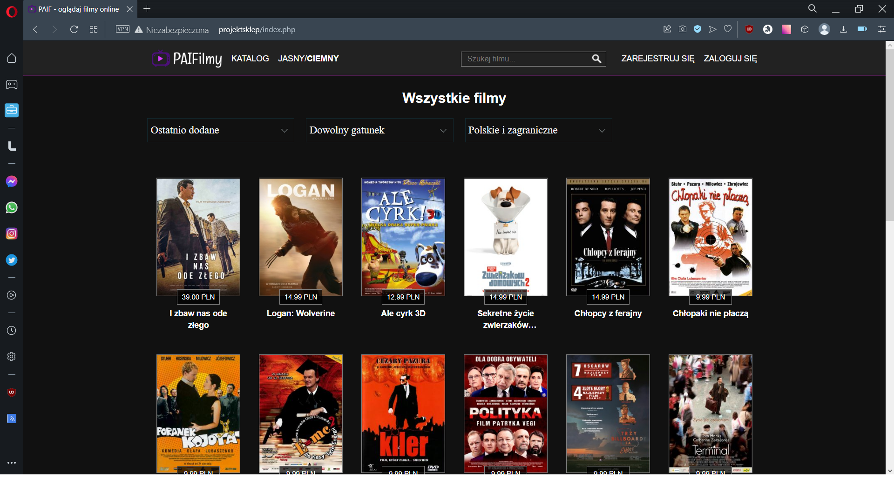

# PAIFilmy [PHP + MySQL]

Aplikacja internetowa będąca wypożyczalnią filmów, które po zakupie można w niej obejrzeć.

Wykorzystane technologie:

  
  
  
  
  
  
  

## Strona główna

Na stronie głównej możemy znaleźć dwie karuzele przedstawiające ostatnio dodane filmy oraz te najpopularniejsze wśród innych użytkowników.

## Katalog

Przechodząc na podstronę "Katalog" możemy przejrzeć wszystkie filmy dostępne na stronie. Dodatkowo mamy możliwość posortowania ich po:

- dacie dodania
- alfabetycznie
- popularności

Lista filmów może również zostać odfiltrowana według gatunku filmu oraz kraju produkcji.

## Rejestracja

Strona posiada możliwość założenia konta za pomocą podstrony "Zarejestruj się"

W formularzu rejestracyjnym należy wypełnić 4 pola:

- nazwa użytkownika
- adres email
- hasło
- powtórz hasło

Dodatkowo pole "nazwa użytkownika" oraz "hasło" posiadają ikonę wykrzyknika, która po aktywacji poprzez najechanie myszą pokazuje wytyczne do tych pól.

W przypadku źle wypełnionych pól zostaną one oznaczone na czerwono oraz zostanie wyświetlona wskazówka mówiąca o tym co zostało wypełnione źle.

## Logowanie

Gdy posiadamy konto w serwisie, za pomocą strony logowania możemy się zalogować podając login oraz hasło.

## Użytkownik zalogowany

Jako użytkownik zalogowany mamy dostęp do nowych podstron

- moje filmy - zawierającą filmy posiadane przez użytkownika
- koszyk - pokazującą filmy znajdujące się w koszyku użytkownika
- ustawienia - pozwalającą na zmianę ustawień użytkownika, dodanie adresu oraz sprawdzenie historii zamówień
- wyloguj się - służącą wylogowaniu użytkownika

## Strona filmu

Wybierając jakiś film z katalogu lub ze strony głównej zostajemy przeniesieni na stronę ze zwiastunem oraz opisem danego filmu. Znajduje się tam także przycisk pozwalający na zakup filmu.

## Koszyk

Po naciśnięciu przycisku zakup, produkt znajduje się w naszym koszyku, z którego możemy podejrzeć produkty w koszyku, usunąć je z koszyka oraz zfinalizować zakup

## Moje filmy

Strona wyświetla wszystkie posiadane przez nas filmy. Każdy zakupiony przez nas film zostaje oznaczony zieloną ikoną w lewym górnym rogu.

Wejście w zakupiony przez nas film przeniesie nas do strony, na której będziemy mogli go obejrzeć.

## Ustawienia

Strona ustawień pozwala na zmianę adresu email oraz hasła, dodanie, edycję lub usunięcie naszego fizycznego adresu, a także podgląd dokonanych przez nas transakcji

## Historia płatności

Na tej podstronie możemy zobaczyć historię transakcji dokonanych przez użytkownika oraz przejść do szczegółów każdej z nich.

## Wyszukiwanie filmów

Strona pozwala na wyszukiwanie filmów za pomocą pola "Wyszukaj" znajdującego się w pasku nawigacyjnym u góry strony. Aby wyszukać film należy wpisać dowolną frazę powiązaną z danym filmem.

## Panel administracyjny

Istnieją dwa rodzaje kont:
- zwykły użytkownik
- administrator

Administrator ma dostęp do panelu administracyjnego, gdzie przy pomocy formularza może dodawać nowe filmy do sklepu.

